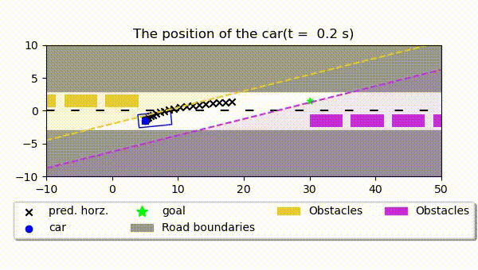

# Car MPC
This repository contains two types of MPC controller that uses a linear kinematic bicycle model and a LQR controller.
A state feedback and an output feedback based model predictive controller.
The dynamics of the car are simulated with a nonlinear model.
The controller takes state and input constraints into account and has a terminal constraint to ensure stability.
The control invariant set with the unconstrained LQR control law is used to compute the terminal set.
More information can be found in the [paper](media/paper.pdf), which also contains the proof that ensures asymptotic stability.

## Environments
The repository contains several environments to run a simulation in with a controller. These can be found in `lib/environments.py`:

|                `RoadEnv`                 |                `RoadOneCarEnv`                 |                `RoadMultipleCarsEnv`                 |
|:----------------------------------------:|:----------------------------------------------:|:----------------------------------------------------:|
|  |  |  |

### State Feedback MPC
`examples/run_MPCStateFB.py` contains an example which runs the state feedback based MPC.

[//]: # (![State Feedback MPC simulation .gif]&#40;media/MPCStateFB.gif&#41;)

### Output Feedback MPC
`examples/run_MPCOutputFB.py` contains an example which runs the output feedback based MPC.

[//]: # (![Output Feedback MPC simulation .gif]&#40;media/MPCOutputFB.gif&#41;)

### LQR controller

`examples/run_LQR.py` contains an example which runs the LQR controller.

### Terminal set
`examples/find_terminal_set.py` computes the terminal set for a specific environment with a specific goal and saves it to `terminal_sets/`.
The MPC controller looks for a terminal set, when it needs to run in a specific environment with a specific goal.
When there is no terminal set for that specific combination, it uses the goal state for the terminal constraint.
Since this is a much stricter constraint, the region of attraction reduces, which might make the MPC problem infeasible.

|                      `RoadOneCarEnv`                      |                      `RoadMultipleCarsEnv`                      |
|:---------------------------------------------------------:|:---------------------------------------------------------------:|
|  |  |

